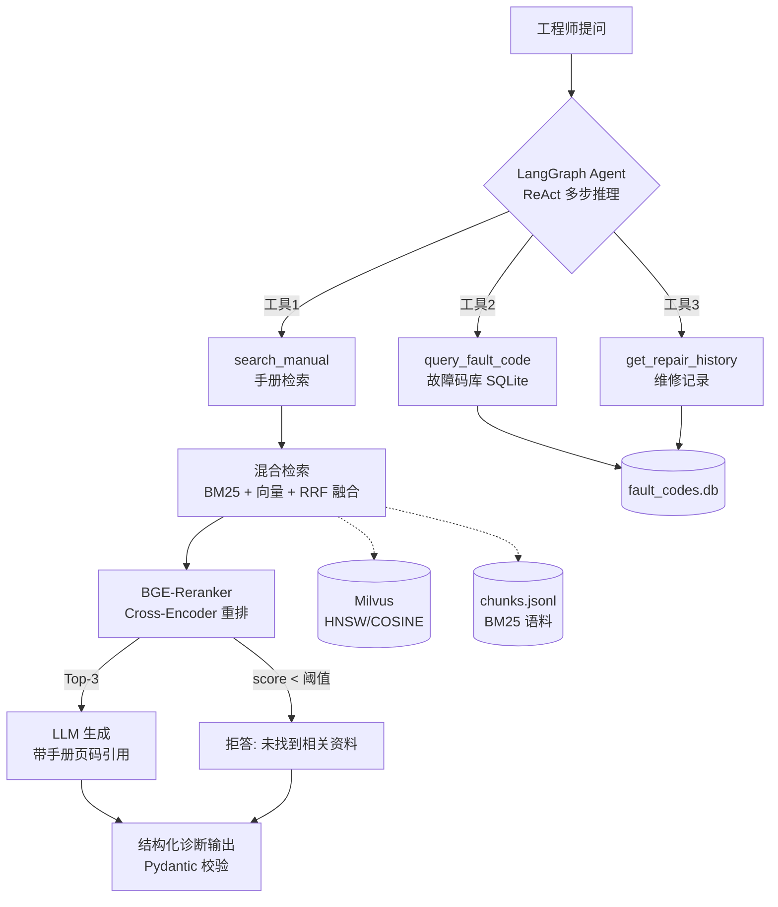

# 🏭 工业设备智能运维知识库 (Industrial Equipment RAG + Agent)

> 一线工程师用自然语言查设备手册、诊断故障 — 基于混合检索 RAG + LangGraph Agent 的私有知识库系统。

## 这是什么

工厂里查一个故障码要翻几百页 PDF 手册。本系统把西门子 PLC / 发那科机器人 / 变频器等设备手册
向量化入库,工程师直接提问,得到**带手册页码引用**的答案;复合问题由 Agent 自主调用
手册检索 / 故障码库 / 维修记录三个工具,多步推理后给出综合诊断。

**语料**: 真实公开手册 — 西门子 S7-1200 系统手册中文版(1156 页)+ 三菱 FX3U 硬件手册(跨品牌干扰项)。
故障码库含西门子 PLC/变频器、三菱 FX3U、发那科机器人共 16 个故障码 + 7 条维修记录。

**架构**:



## 量化指标

> ⚠️ 占位符 — 跑 `python -m src.eval.run_eval` 后用真实数据替换

| 检索模式 | Top-3 命中率 | 平均延迟 |
|---|---|---|
| 纯向量 (baseline) | __% | __ms |
| 混合检索 (BM25+向量+RRF) | __% | __ms |
| 混合 + BGE-Reranker | **__%** | __ms |

测试集: `src/eval/testset.jsonl` — 26 道问答对,**每题人工锚定真实手册页码**
(构建方法见 DECISIONS.md #12);另有 `testset_refusal.jsonl` 5 道语料外问题测拒答。

## 快速开始

```bash
# 1. 环境
conda create -n rag python=3.11 -y && conda activate rag
pip install -r requirements.txt

# 2. 配置 (填 DeepSeek API key)
cp .env.example .env

# 3. 启动 Milvus
docker compose -f deploy/docker-compose.yml up -d

# 4. 下载公开手册到 data/raw/ (西门子/三菱官方公开直链), 然后入库
#    (Windows 终端建议先: set PYTHONUTF8=1, 避免 GBK 编码报错)
curl -L -o data/raw/s71200_system_manual_zh.pdf "https://cache.industry.siemens.com/dl/files/622/91696622/att_42775/v1/s71200_system_manual_zh-CHS_zh-CHS.pdf"
curl -L -o data/raw/fx3u_hardware_manual_zh.pdf "https://docs.rs-online.com/aed2/A700000008409570.pdf"
python -m src.ingest

# 5. 初始化故障码库 (Agent 工具数据源)
python scripts/init_fault_db.py

# 6. 启动
python -m src.ui            # Gradio 界面 http://localhost:7860
# 或
uvicorn src.api:app --reload  # REST API http://localhost:8000/docs
```

## 跟普通 RAG demo 有何不同

1. **混合检索**: 工业术语/型号(如 "S7-1200"、"F0001")语义向量常匹配不准,BM25 关键词通道补上;RRF 融合免调权重
2. **Reranker 二次排序**: Cross-Encoder 逐对打分,Top-3 命中率显著高于纯向量(见指标表)
3. **拒答机制**: 重排分数低于阈值直接拒答,不硬编 — 工业场景答错代价高
4. **引用溯源**: 每个答案标注 [手册名 第N页],工程师可回查原文
5. **Agent 分层**: 复合问题("E203 是什么故障?之前修过吗?")自主拆解多工具调用
6. **结构化输出**: 诊断结果为 Pydantic 校验的 JSON,可直接接工单系统

## 项目结构

```
src/
├── config.py      # 所有可调参数集中在这
├── ingest.py      # PDF → 分块 → embedding → Milvus
├── retrieval.py   # 向量 + BM25 + RRF + Reranker (三种模式可对比)
├── rag_chain.py   # RAG 生成链: 引用 + 拒答
├── schemas.py     # Pydantic 结构化诊断输出
├── agent.py       # LangGraph ReAct Agent (3 工具)
├── api.py         # FastAPI
├── ui.py          # Gradio
└── eval/          # 评测: 三种检索模式对比
scripts/init_fault_db.py   # 故障码 SQLite 初始化
deploy/docker-compose.yml  # Milvus standalone
```

## 技术选型

见 [DECISIONS.md](DECISIONS.md) — 为什么 Milvus 而不是 FAISS、为什么 chunk_size=500、
为什么 RRF 而不是加权求和,每个决策都有记录。

## License

MIT
